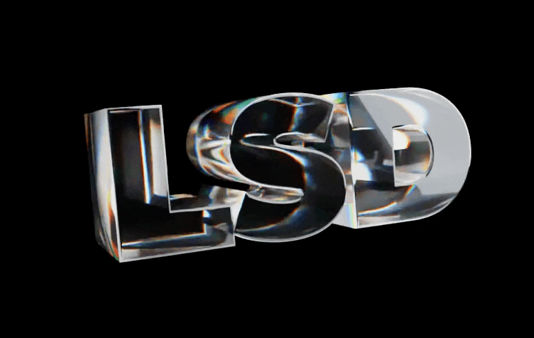

<p align="center">
  <a href="https://html2.io">
    
  </a>
  <h1 align="center"><a href="https://grida.co/lsd">The Bundle</a></h1>
  <p align="center">The Bundle by Grida - Ultimated 3D rendered graphics resources pack</p>
</p>

- [objects](./objects/)
- [materials](./materials/)
- [templates](./templates/)
- [dmt](./dmt/)
- [farm](./farm/)
- [docs](./docs)

### Fonts

We use Google fonts for our default font support module, which each font file is resolved from google/fonts repository as a submodule. To get all the fonts, you need to run the following command after cloning the repository.

```baas
git submodule update --init --recursive
```

Learn more about supported fonts [here](./fonts/README.md).

## License

Unless explicitly specified, all directories are licensed under the MIT License © 2023 [Grida](https://grida.co)

**Except - Explicit artworks**

Directories and files listed below are not licensed under the MIT License, and are not subject to the terms and conditions of the MIT License. You may not use or distribute any of them, and you may not clone any of them into your own repository for commercial purposes. Contact [Grida](https://grida.co) for more information.

- /templates
- /fonts
- /lib
