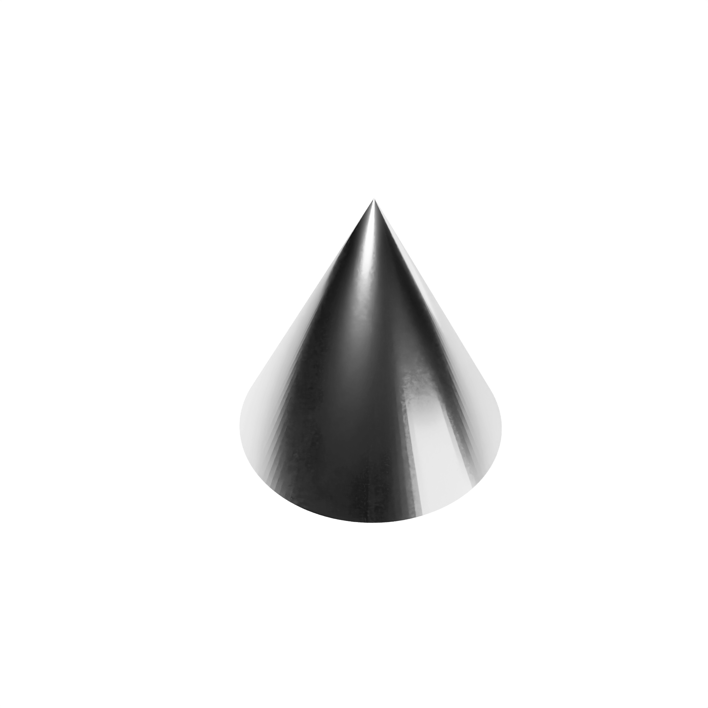
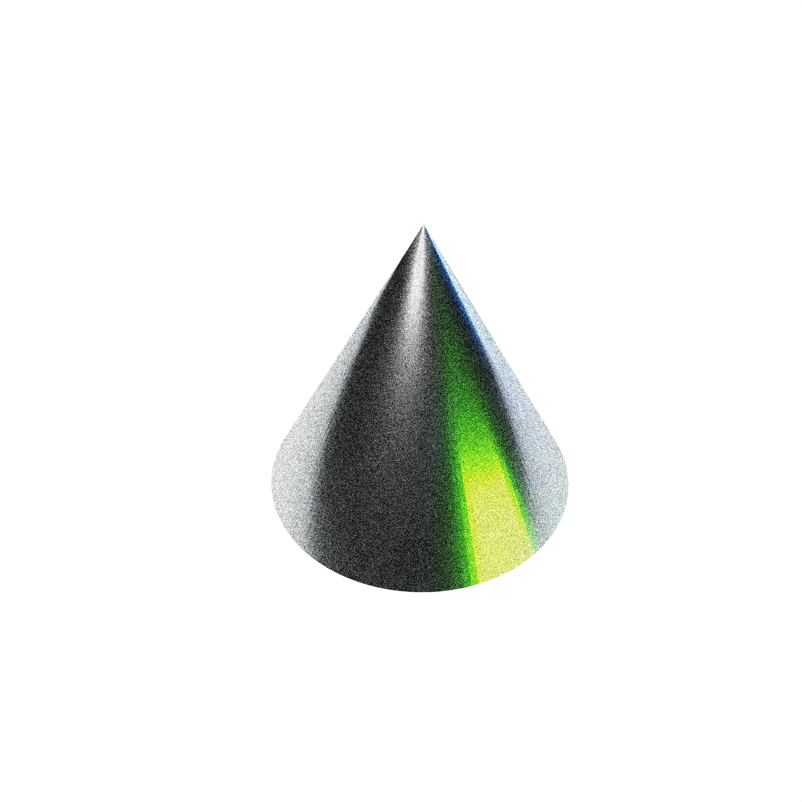

# Post production Image Processing

The primary purpose of this module is to enhance the quality of rendered images on lower sample counts and resolution. This is done by applying various post production effects to the rendered image. while rendering tool takes account more accurate and theoretically correct approach to rendering, this module is primarily focused on the time-saving perspective.

## Grayscale

<!-- before / after image view -->

|         Original          |              Grayscale              |
| :-----------------------: | :---------------------------------: |
|  |  |

## Grain Noise

| i     |         Original          |              Grayscale              |
| :---- | :-----------------------: | :---------------------------------: |
| `0.1` |  |  |
| `0.2` |  |  |
| `0.3` |  |  |
| `0.4` |  |  |
| `0.5` |  |  |
