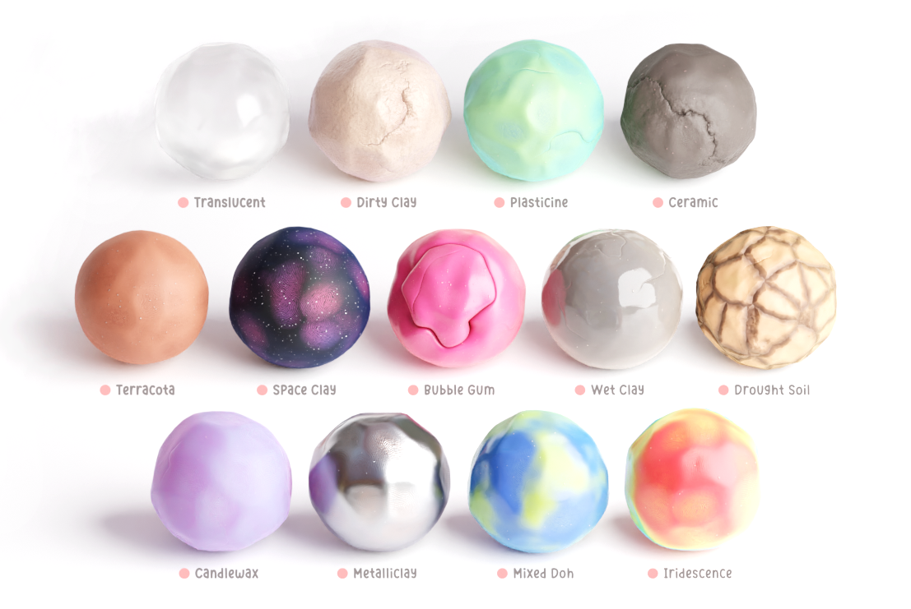

# Clay Doh Presets

Original Material Pack by DoubleGun team via [Blender Market](https://blendermarket.com/products/claydoh)

Check out the original author's [Link Tree](https://www.linktr.ee/doublegum)

Current Version: 3.0

## Contents

- ~~Backdrop~~
- Bubble Gum
- Candlewax
- Ceramic
- ~~Circle~~
- Dirty Clay
- ~~Dots Stroke~~
- Drought Soil
- Iridescence
- Metalliclay
- Mixed Doh
- Plasticine
- Space Clay
- Terracotta
- ~~Text~~
- Translucent
- Wet Clay

## License

Since the [license](https://blendermarket.com/page/royalty-free-license), does not allow us to redistribute this file, we are not including the ojbects files in this repository. You can purchase the file from [here](https://blendermarket.com/products/claydoh) and place the blender file (`Clay 3.Doh PRESETS (Blender 3.2+).blend`) under this directory.
