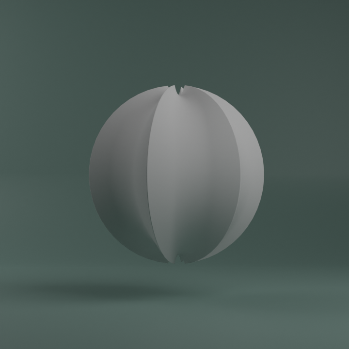

# Object Pack - Motion Primatives

Origianl distribution: [Gumroad](https://attimp4.gumroad.com/l/MotionPrimatives)

## Original Author: atti

The contents under this directory are the original work of atti. Downloaded from [Gumroad](https://attimp4.gumroad.com/l/MotionPrimatives), his distribution channel.

- [YouTube](https://www.youtube.com/@attimp4)
- [Twitter](https://twitter.com/atti3D)

## Contents

| Object                                      | File                          | Description |
| ------------------------------------------- | ----------------------------- | ----------- |
|    | [1.blend](./blends/1.blend)   |             |
|    | [2.blend](./blends/2.blend)   |             |
|    | [3.blend](./blends/3.blend)   |             |
|    | [4.blend](./blends/4.blend)   |             |
|    | [5.blend](./blends/5.blend)   |             |
|    | [6.blend](./blends/6.blend)   |             |
|    | [7.blend](./blends/7.blend)   |             |
|    | [8.blend](./blends/8.blend)   |             |
|    | [9.blend](./blends/9.blend)   |             |
|  | [10.blend](./blends/10.blend) |             |
|  | [11.blend](./blends/11.blend) |             |
|  | [12.blend](./blends/12.blend) |             |
|  | [13.blend](./blends/13.blend) |             |
|  | [14.blend](./blends/14.blend) |             |
|  | [15.blend](./blends/15.blend) |             |
|  | [16.blend](./blends/16.blend) |             |
|  | [17.blend](./blends/17.blend) |             |
|  | [18.blend](./blends/18.blend) |             |
|  | [19.blend](./blends/19.blend) |             |
|  | [20.blend](./blends/20.blend) |             |
|  | [21.blend](./blends/21.blend) |             |
|  | [22.blend](./blends/22.blend) |             |
|  | [23.blend](./blends/23.blend) |             |
|  | [24.blend](./blends/24.blend) |             |
|  | [25.blend](./blends/25.blend) |             |
|  | [26.blend](./blends/26.blend) |             |
|  | [27.blend](./blends/27.blend) |             |
|  | [28.blend](./blends/28.blend) |             |
|  | [29.blend](./blends/29.blend) |             |
|  | [30.blend](./blends/30.blend) |             |
|  | [31.blend](./blends/31.blend) |             |
|  | [32.blend](./blends/32.blend) |             |
|  | [33.blend](./blends/33.blend) |             |
|  | [34.blend](./blends/34.blend) |             |
|  | [35.blend](./blends/35.blend) |             |
|  | [36.blend](./blends/36.blend) |             |
|  | [37.blend](./blends/37.blend) |             |
|  | [38.blend](./blends/38.blend) |             |
|  | [39.blend](./blends/39.blend) |             |
|  | [40.blend](./blends/40.blend) |             |
|  | [41.blend](./blends/41.blend) |             |
|  | [42.blend](./blends/42.blend) |             |
|  | [43.blend](./blends/43.blend) |             |
|  | [44.blend](./blends/44.blend) |             |
|  | [45.blend](./blends/45.blend) |             |
|  | [46.blend](./blends/46.blend) |             |

## LICENSE

Free for commercial use, as described by atti.
As there were no LICENSE file in the original distribution, We are assigning the Apache 2.0 License to this directory. (Please report for any issues.)

## Disclaimer

We are hosting this resources on Github for the use in the porject, with any intend of redistribution.
If you are looking for the official distribution, please visit [Atti's Gumroad Page](https://attimp4.gumroad.com/l/MotionPrimatives).
